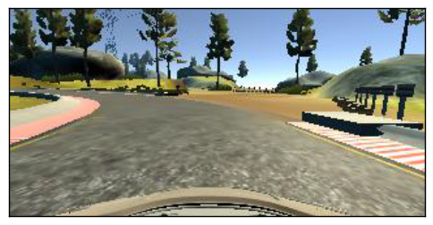

# **Behavioral Cloning** 


---

**Behavioral Cloning Project**

The goals / steps of this project are the following:
* Use the simulator to collect data of good driving behavior
* Build, a convolution neural network in Keras that predicts steering angles from images
* Train and validate the model with a training and validation set
* Test that the model successfully drives around track one without leaving the road
* Summarize the results with a written report


## Rubric Points
### Here I will consider the [rubric points](https://review.udacity.com/#!/rubrics/432/view) individually and describe how I addressed each point in my implementation.  

---
### Files Submitted & Code Quality

#### 1. Submission includes all required files and can be used to run the simulator in autonomous mode

My project includes the following files:
* model.py containing the script to create and train the model
* drive.py for driving the car in autonomous mode
* model.h5 containing a trained convolution neural network 
* writeup.md or writeup_report.pdf summarizing the results
* video.mp4 contains the video of the autonomous car driving

#### 2. Submission includes functional code
Using the Udacity provided simulator and my drive.py file, the car can be driven autonomously around the track by executing 
```sh
python drive.py model.h5
```

#### 3. Submission code is usable and readable

The model.py file contains the code for training and saving the convolution neural network. The file shows the pipeline I used for training and validating the model, and it contains comments to explain how the code works.

### Model Architecture and Training Strategy

#### 1. An appropriate model architecture has been employed

I tried to use the the model architecture by NVIDIA as suggested in the lectures. The architecture consisted of the 5 convolution layers and 4  fully connected layers along with the flatten layer in between.And also the normalization layer is used which would make to normalize the images and the cropping layer which was use to remove the tree and the sky part. 

#### 2. Attempts to reduce overfitting in the model

I trained my model on different run of the epoch so that the overfitting was avoided and the perfect model was in place

#### 3. Model parameter tuning

The model used an adam optimizer, so the learning rate was not tuned manually.

#### 4. Appropriate training data

Training data was chosen to keep the vehicle driving on the road. I used a combination of center lane driving, recovering from the left and right sides of the road and also in the architecture the data was used in such a way so that there was no redundances in the images like cropping and the normalization of the images



### Model Architecture and Training Strategy
The overall strategy for deriving a model architecture was to  making sure that the car remains in the road and not goes to the river. In the earlier stages of this project my car was going either way so cropped the images and also used the concept of the mid point of left and right lane

My first step was to use a convolution neural network model similar to the Nvidia architecture. I thought this model might be appropriate because I thought generally in the image recognition task the layers of conv,relu,pool are three but in this I thought the more concise features from the images should be needed.

In order to gauge how well the model was working, I split my image and steering angle data into a training and validation set. I found that my first model had a low mean squared error on the training set but a high mean squared error on the validation set. This implied that the model was overfitting.

To combat the overfitting, I trained my model on different run of the epoch so that the overfitting was avoided and the perfect model was in place.


The final step was to run the simulator to see how well the car was driving around track one. There were a few spots where the vehicle fell off the track... to improve the driving behavior in these cases, so I trained it on more epochs and it was working well

At the end of the process, the vehicle is able to drive autonomously around the track without leaving the road.ain. To improve the driving behavior in these cases, I used generator to train my model in batches.

